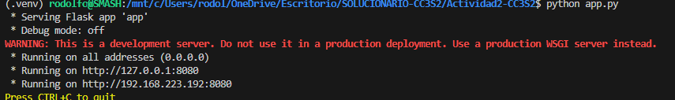

## 1) HTTP: Fundamentos y herramientas
### Levanta la app con variables de entorno (12-Factor):
#### 1. Variables de entorno de app.py:
```python
##12-Factor:varibles de entorno
PORT=8080 MESSAGE="Hola CC3S2" RELEASE="v1" python app.py
```


#### 2. Inspección con curl  
Detalles de la petición HTTP:

Peticiones por GET:


#### Pregunta guía: ¿Qué campos de respuesta cambian si actualizas MESSAGE/RELEASE sin reiniciar el proceso? Explica por qué.
Como el proceso ya está en memoria, los cambios en el entorno del sistema no afectan al proceso que ya está corriendo. Para que cambien los valores de message y release en la respuesta JSON, es necesario detener la app y volver a ejecutarla con las nuevas variables.

#### 3. Puertos abiertos con ss


#### 4. Logs como flujo
Levantamos algunas peticiones:


y nos genera: 
