## 1) HTTP: Fundamentos y herramientas
### Levanta la app con variables de entorno (12-Factor):
### 1. Variables de entorno de app.py: 
```python
##Se instala Flask
pip install flask
```
Se levanta la app Flask indicando el puerto 8080, el mensjae y la version. Esto aplica el principio 12-Factor: configuración por entorno en lugar de "quemar" valores en el código.

```python
##12-Factor:varibles de entorno
PORT=8080 MESSAGE="Hola CC3S2" RELEASE="v1" python app.py
```
La app empieza a escuchar en http://127.0.0.1:8080 y loguea en stdout.  

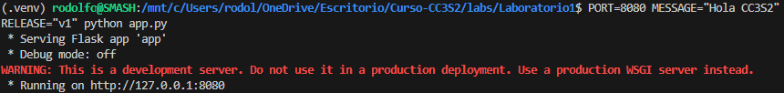

### 2. Inspección con "curl"  
#### Peticion GET:  
"curl -v http://127.0.0.1:8080/" se usa en modo verbose (-v) para ver las cabeceras de la petición y la respuesta.
La app responde con código 200 OK y un JSON que incluye "message" y "release".

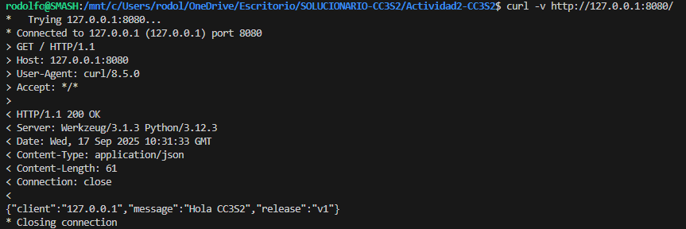

#### Peticion POST:  
"curl -i -X POST http://127.0.0.1:8080/" simula  una petición POST a la raíz. Como no existe ruta para POST en Flask,
la respuesta es 405 METHOD NOT ALLOWED. Esto demuestra cómo el servidor valida métodos HTTP.


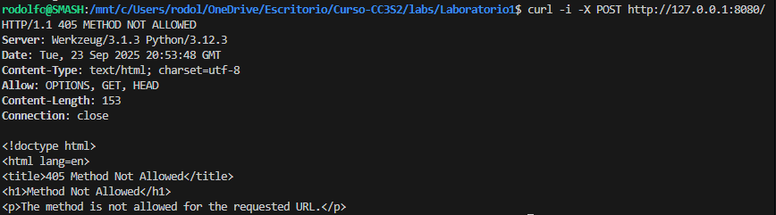

### Pregunta guía: ¿Qué campos de respuesta cambian si actualizas MESSAGE/RELEASE sin reiniciar el proceso? Explica por qué.
Como el proceso ya está en memoria, los cambios en el entorno del sistema no afectan al proceso que ya está corriendo. Para que cambien los valores de message y release en la respuesta JSON, es necesario detener la app y volver a ejecutarla con las nuevas variables.

### 3. Puertos abiertos con ss
Verificamos que puertos se escuchan en el puerto 8080  

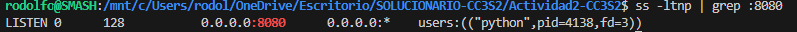

#### 4. Logs como flujo 
Levantamos algunas peticiones: 

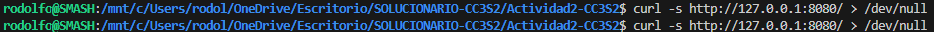
y nos genera:

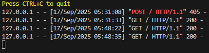

## 2) DNS: nombres, registros y caché
**Meta:** resolver `miapp.local` y observar TTL/caché.
1. **Hosts local:** agrega `127.0.0.1 miapp.local
    Agrego la entrada en /etc/hosts para que el nombre "miapp.local" resuelva a 127.0.0.1.
Esto simula un dominio en mi máquina local, que sera muy útil para las pruebas de laboratorio.

    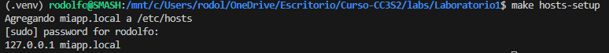

2. **Comprueba resolución:**

   * `dig +short miapp.local` (debe devolver `127.0.0.1`).
   * `getent hosts miapp.local` (muestra la base de resolución del sistema).

     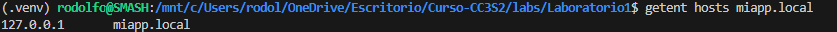

3. **TTL/caché (conceptual):** con `dig example.com A +ttlunits` explica cómo el TTL afecta respuestas repetidas (no cambies DNS público, solo observa).

    Observo el campo TTL (Time To Live) en segundos,  indica cuánto tiempo una respuesta DNS puede guardarse en caché.
|   Si repito la consulta varias veces, mientras no expire el TTL, la respuesta proviene de caché y no del servidor autoritativo.

    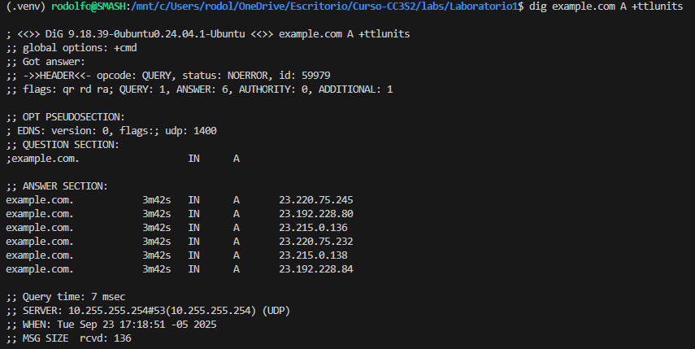

    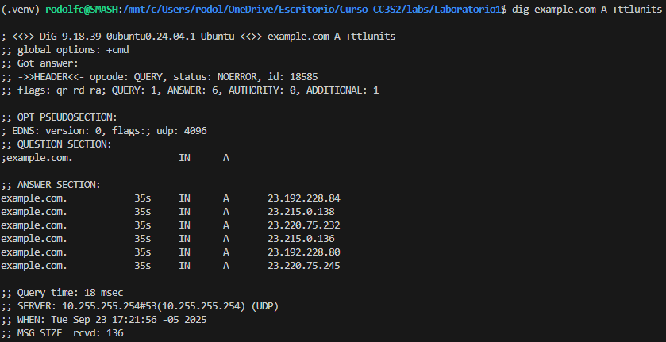

4. **Pregunta guía:** ¿Qué diferencia hay entre **/etc/hosts** y una zona DNS autoritativa? ¿Por qué el *hosts* sirve para laboratorio? Explica en 3–4 líneas.  

    `/etc/hosts` es un archivo local que fuerza la resolución de nombres a IPs específicas, útil para laboratorios y pruebas.
    Una zona DNS autoritativa, en cambio, se gestiona en servidores DNS y es distribuida a través de Internet, permitiendo escalabilidad y actualización centralizada.
    Para laboratorio usamos /etc/hosts porque no necesitamos montar un servidor DNS completo, basta con mapear el nombre a 127.0.0.1 en local.

## 3) TLS: seguridad en tránsito con Nginx como *reverse proxy*

**Meta:** terminar TLS en Nginx `:443` y *proxyear* a Flask en `127.0.0.1:8080`.

1. **Certificado de laboratorio:** genera autofirmado (usa el *target* `make tls-cert` si existe) y coloca crt/key donde lo espera Nginx (ver guía).
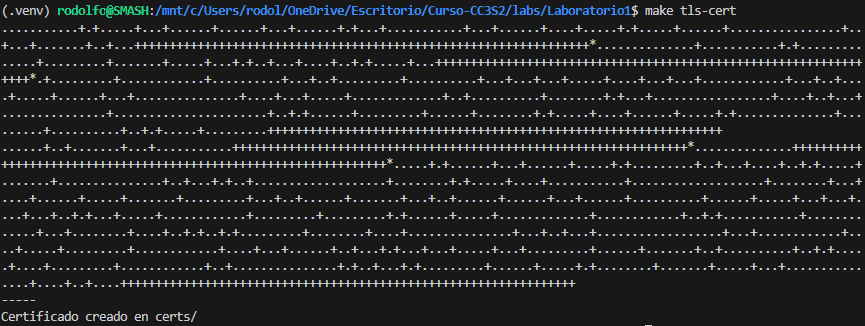

2. **Configura Nginx:** usa el ejemplo provisto para **terminación TLS** y **proxy\_pass** a `http://127.0.0.1:8080` con cabeceras `X-Forwarded-*`. Luego `nginx -t` y **reinicia** el servicio.
   Incluye el *snippet* clave de tu `server` en el reporte.
   
3. **Valida el *handshake*:**

   * `openssl s_client -connect miapp.local:443 -servername miapp.local -brief` (muestra TLSv1.2/1.3, cadena, SNI).
   * `curl -k https://miapp.local/` (explica el uso de `-k` con certificados autofirmados).
5. **Puertos y logs:**

   * `ss -ltnp | grep -E ':(443|8080)'` (evidencia de ambos sockets).
   * `journalctl -u nginx -n 50 --no-pager` **o** `tail -n 50 /var/log/nginx/error.log` (pega 3–5 líneas relevantes).

> Nota: el *vínculo*  Nginx->Flask es **HTTP interno** en `127.0.0.1:8080`, tu cliente entra por **HTTPS** en `:443`.