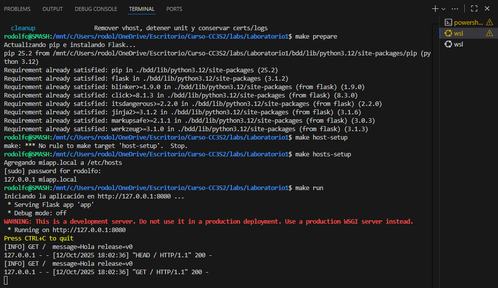
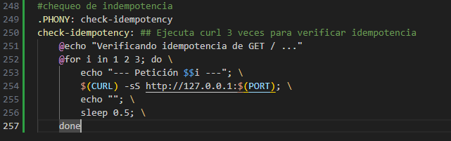
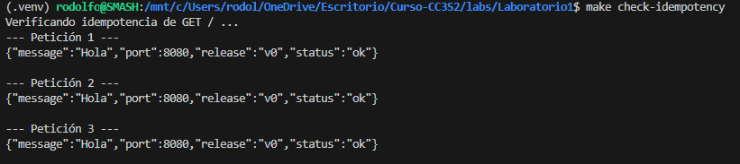
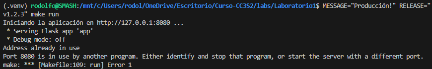
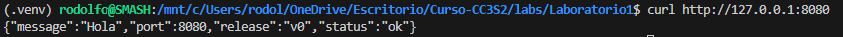

### Actividad 3: Integración de DevOps y DevSecOps con HTTP, DNS, TLS y 12-Factor App

### Parte practica: 
1. **Automatización reproducible con Make y Bash (Automation en CALMS).**
   Ejecuta Makefile para preparar, hosts-setup y correr la app. Agrega un target para verificar idempotencia HTTP (reintentos con curl). Explica cómo Lean minimiza fallos.
   Haz una tabla de rastreo de objetivos con esta cabeceras,  "objetivo -> prepara/verifica -> evidencia" de Instrucciones.md. 
   #### Solucion y comentarios: 
   Preparamos el Mkaefile, hosts-setup y corremos la app:
   

   Para verificar la idempotencia, se añade un nuevo target al Makefile:

   

   Evidencia de idempotencia: La salida es idéntica en cada petición, demostrando que GET / no tiene efectos secundarios.

   

   La metodología Lean se aplica al minimizar el "desperdicio" (tiempo y esfuerzo) en tareas manuales. Cada target del Makefile es un pequeño paso automatizado que previene errores y asegura consistencia, lo cual es un principio clave de Lean.

2. **Del código a producción con 12-Factor (Build/Release/Run).**
   Modifica variables de entorno (`PORT`, `MESSAGE`, `RELEASE`) sin tocar código. Crea un artefacto inmutable con `git archive` y verifica paridad dev-prod.
   Documenta en tabla "variable -> efecto observable". Simula un fallo de backing service (puerto equivocado) y resuélvelo con disposability. Relaciona con logs y port binding.

    #### Modificación de variables de entorno
    Se puede cambiar el comportamiento de la app sin tocar app.py, pasándole variables al comando make.
    
    En otra terminal verificamos el cambio: 
    

    

